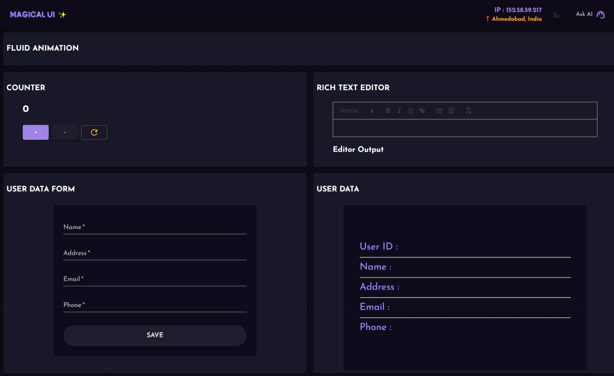
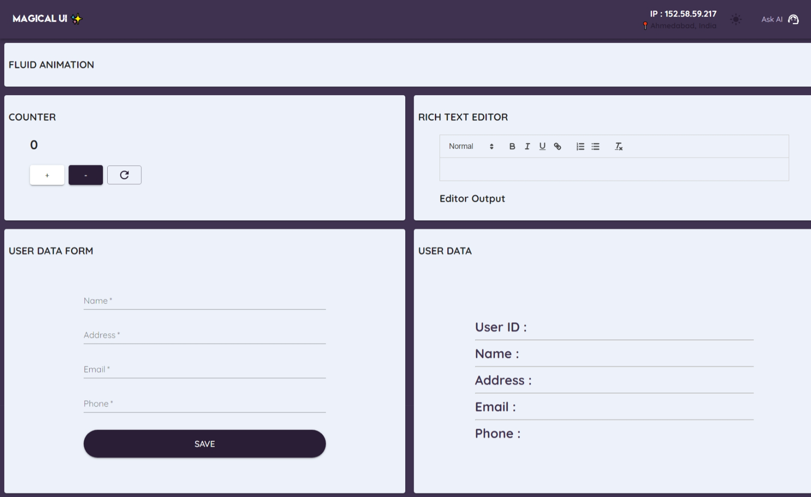
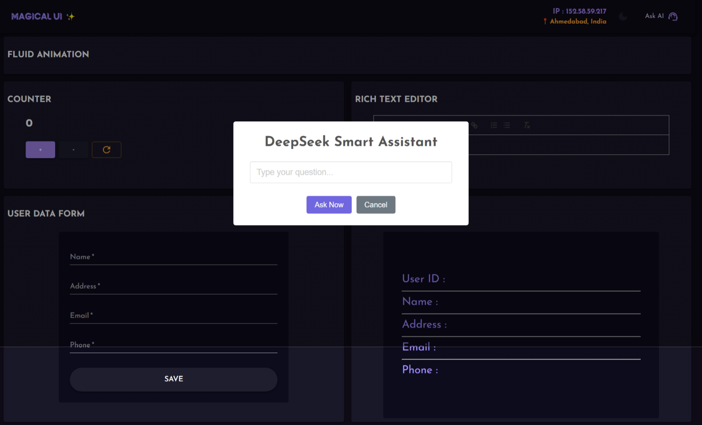
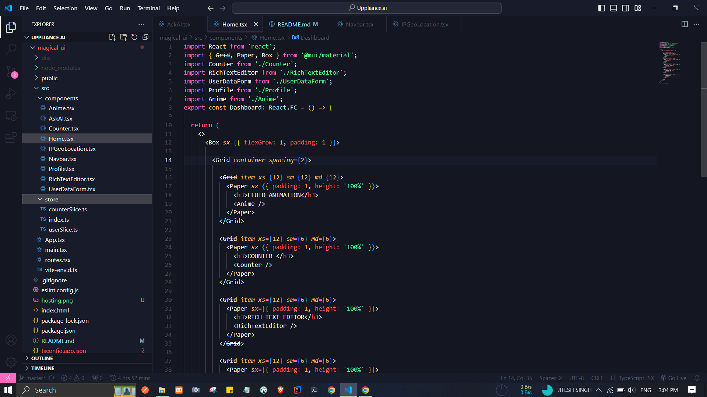

> # Magical UI

 ### Hosting :: https://magical-web.vercel.app/

### Components -
- Counter
- Fluid Animation
- User Data Form
- Rich Text Editors
  
> ### I have added some add-ons for better user experince
> - IP Address with GeoLocation
> - ASK AI (Actual Deepseek AI from Openrouter API)
> - Dark Background Switch

### Tech Stack Utilized -
- React + Vite
- Typescript
- Material UI
- Redux Toilkit
- React Spring
- React Router
- React Quill
- SweetAlert
- Axios
- IPWhoIs
- DEEPSEEK OpenRouter API

### Snapshots -

