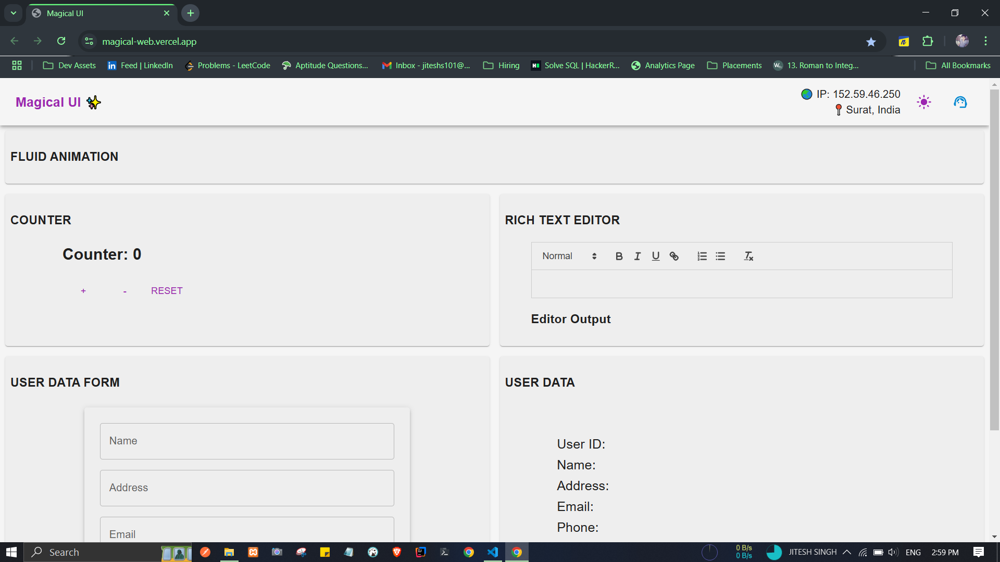

> # Magical UI Project For Upliance.ai

 ### Hosting :: https://magical-web.vercel.app/

### Components -
- Counter
- User Data Form
- Rich Text Editors
  
> #### I have added some add-ons for better user experince
> - IP Address with GeoLocation
> - ASK AI
> - Dark Background Switch

### Tech Stack Utilized -
- React + Vite
- Typescript
- Material UI
- Redux Toilkit
- Local Storage
- React Spring
- React Router
- React Quill
- SweetAlert
- Axios
- IPWhoIs

### Snapshots -

